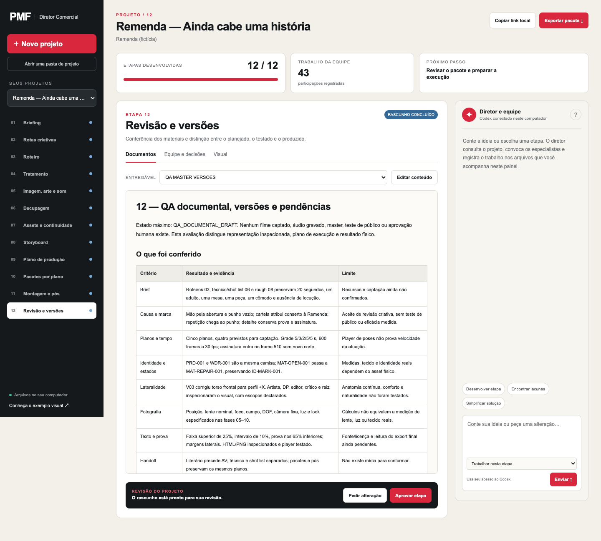

# Commercial Film Director

[Baixar a versão](https://github.com/pmfproducer/commercial-film-director/releases/latest) · [Instalação](#instalação-local) · [Exemplo](#exemplo-visual)

Skill de criação e realização publicitária com direção e especialistas temporários, formação por departamento e repertório de pesquisa consultável. A pessoa traz uma ideia; a sala desenvolve história, encenação, imagem, arte, montagem, som e plano de execução.

## Dashboard incluído



O painel local permite criar ou abrir um projeto, acompanhar as 12 etapas, consultar
as tarefas reais dos especialistas, editar documentos com histórico, aprovar ou pedir
revisões, navegar pelos storyboards existentes e exportar o projeto em ZIP.

Depois de instalar, abra com:

```bash
python3 "$HOME/.codex/skills/commercial-film-director/scripts/dashboard.py"
```

O navegador abre automaticamente. Para continuar um projeto existente, use
`--project-dir "/caminho/do/projeto"`. O painel usa apenas Python e arquivos locais.
O botão de conversar com a direção usa **Codex CLI instalado e autenticado com
`codex login`**, consumindo os limites dessa conta. Não exige chave de API adicional.
Sem o CLI, consulta, edição, revisão e exportação continuam disponíveis.
Instalar a skill não inicia o servidor sozinho; peça para abrir o dashboard ou execute o comando.

[Guia do dashboard](references/dashboard.md)

## Funcionamento

O diretor formula a questão do filme e convoca os especialistas pertinentes. Cada tarefa recebe um pacote com o contrato da profissão, trechos curriculares, referências recuperadas e fontes. As áreas propõem soluções, discutem dependências e revisam decisões. A direção integra o resultado.

Roteiro literário, roteiro audiovisual, roteiro técnico, shot list e storyboard continuam entregas distintas. Materiais visuais são produzidos com as ferramentas disponíveis quando a etapa e o pedido exigirem; sua geração não é executada pelo organizador de arquivos.

## Instalação local

Copie esta pasta completa para o diretório de skills do ambiente. É necessário um assistente compatível com skills e acesso a arquivos; a discussão entre agentes usa o recurso de subagentes desse ambiente. Quando esse recurso não existe, os passes são identificados como simulação de papéis. O pacote usa Python 3.10 ou mais recente e biblioteca padrão, sem servidor ou serviço pago para consultar o repertório. O ensaio completo foi executado em macOS; outros sistemas ainda não passaram pelo mesmo ensaio. A instalação inclui textos de pesquisa, índices e modelos; não inclui vídeos, áudios nem contact sheets.

### Instalar pelo ZIP

1. Abra [Releases](https://github.com/pmfproducer/commercial-film-director/releases/latest) e baixe `commercial-film-director-v6.1.0.zip`.
2. Extraia o arquivo e copie a pasta `commercial-film-director` inteira para o diretório de skills do assistente.
3. Na instalação local de Codex em macOS, a pasta usada é `~/.codex/skills/commercial-film-director`.
4. Em uma nova conversa, peça para usar `commercial-film-director` e conte a ideia do filme.

### Instalar com Git no macOS/Linux

Se essa pasta ainda não existir:

```bash
mkdir -p "$HOME/.codex/skills"
git clone https://github.com/pmfproducer/commercial-film-director.git "$HOME/.codex/skills/commercial-film-director"
```

Se já tiver uma instalação, preserve suas alterações locais antes de substituir a
pasta ou atualizar o clone. Git e ZIP são alternativas de instalação.

## Uso

Peça à skill para desenvolver uma ideia ou continuar um projeto existente. A entrada pode ser uma ideia incompleta; ela deve aproveitar o contexto disponível e perguntar apenas o que realmente altera a criação.

Exemplo de pedido:

> Use a commercial-film-director como minha produtora publicitária. Tenho esta
> ideia: [conte a ideia]. Desenvolva o filme com os especialistas, discuta as
> escolhas usando o repertório e entregue roteiro, proposta visual e plano de
> produção. Trabalhe com estas condições: [duração, público e recursos conhecidos].

O assistente conduz os comandos e entrega os arquivos; a pessoa não precisa
operar o runtime para conversar com a produtora.

Os comandos técnicos abaixo devem ser executados dentro da pasta da skill.
Para inicializar os arquivos de um projeto:

```bash
python3 scripts/project_runtime.py init --project "Nome do filme" --client "Marca" --output "/pasta/de/projetos"
```

A sala é descrita em `references/multiagent-director-room.md`. O comando `assign-task` anexa automaticamente o repertório pertinente ao brief do especialista. A direção pode consultar sua própria base:

```bash
python3 scripts/prepare_repertoire.py --role DIRECTOR --query "problema expressivo do filme" --output /tmp/direction-repertoire.json
```

## Exemplo visual

[Remenda: da ideia às decisões do filme](examples/REMENDA.md) mostra uma revisão
criativa real, o conflito entre fotografia e arte e sua solução. O
[storyboard navegável](examples/REMENDA_ROUGHBOARD.html) abre sozinho, com oito
quadros, prévia temporizada de 20 segundos e planta de câmera e luz. O desenho
é esquemático; a execução física permanece por testar.

Baixe o arquivo HTML na release e abra no navegador. Ele funciona localmente,
sem servidor. A página de arquivo do GitHub mostra o código do HTML.

## Base recuperada

- 19 contratos de especialidades, com jurisdição, perguntas e interfaces.
- Mapa de 17 áreas curriculares, com 67 fontes e 25 instituições registradas.
- 26 perfis profissionais documentais.
- 24 fichas técnicas de filmes e três primeiras passagens/históricos.
- 107 registros de precedentes, associados a 23 obras, com limites e fontes.
- Snapshot textual de 270 arquivos, cerca de 1,8 MB, incluindo fontes de apoio.

O acervo registra leituras audiovisuais instrumentadas **parciais**: zero registros de visionamento integral e zero análises profundas concluídas. A recuperação não alterou esse estado. Não se trata de 107 soluções criativas comprovadas: há também restrições, contracasos e cautelas documentais. A pesquisa de carga horária ainda não foi extraída no mapa curricular.

A memória ajuda a formular e testar propostas; uma correspondência na busca não demonstra eficácia, qualidade criativa ou experiência perceptiva. As fontes originais e suas limitações acompanham cada proposta.

## Verificação

Versão: `commercial-film-director-v6-repertoire`. Em 11/09/2026, um briefing
fictício novo percorreu as 12 fases até o QA documental, com especialistas reais,
três devoluções de direção e storyboard inspecionado. O pacote resultante foi
validado como desenvolvimento completo em rascunho. Esse ensaio não produziu
captação, áudio ou master. Os testes automatizados verificam o funcionamento e a
integridade dos registros; a revisão criativa examina o filme proposto.

```bash
python3 scripts/prepare_repertoire.py --check
python3 scripts/test_repertoire.py
python3 scripts/test_search_precedents.py
python3 scripts/test_runtime.py
```

O manifesto em `references/repertoire/manifest.json` registra as cópias e três correções de caminhos de evidência. Os estudos originais permanecem separados e preservados.

## Limites de uso

A base pode crescer com entrevistas, making-ofs, currículos e análise de cenas
quando o filme exigir uma decisão ainda sem apoio suficiente. Os agentes devem
separar explicação da fonte, observação parcial e interpretação própria. A escolha
de ferramentas, filmagem, geração, montagem e revisão perceptiva continuam etapas
de execução conforme o projeto.

## Licença e fontes

A licença de reutilização do código ainda não foi definida. As fontes e obras
citadas no repertório mantêm seus próprios direitos e atribuições.
